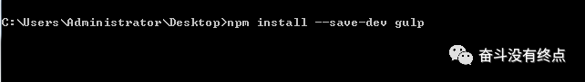
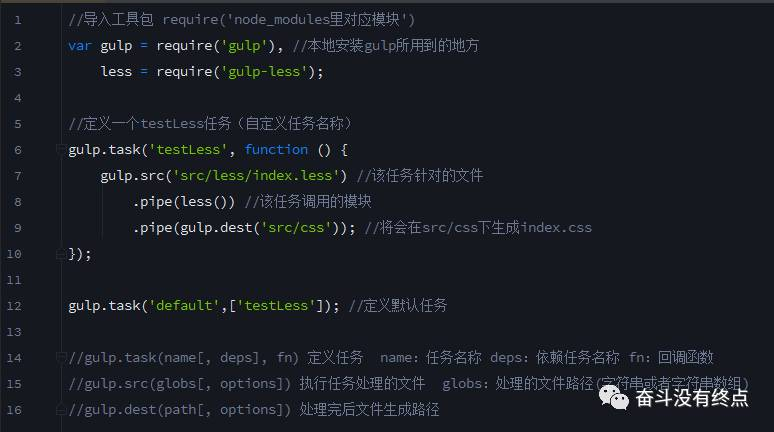

# gulp详细入门介绍

## 1.gulp简介
　　gulp是前端开发过程中对代码进行构建的工具，是自动化项目的构建利器；她能自动化的完成JavaScript/sass/less/html/css等文件的测试、检查、合并、压缩、格式化、浏览器自动刷新、部署文件生成，并监听文件在改动后重复指定的这些步骤。使用它，大大的提高了我们的工作效率。
## 2.gulp的安装

　　gulp是基于nodejs，理所当然需要安装nodejs；这里默认你已经安装过了；

　　打开命令提示行：组合键win+r    输入cmd即可；
然后我们开始安装gulp，输入命令行 npm install gulp -g  ；然后回车，就可全局安装。

如下图

　　另外，如果作为项目的开发依赖（devDependencies）安装：

　　安装成功后，我们可以用gulp -v查看我们安装的gulp的版本号；

## 3.配置package.json

　　package.json 是基于node.js项目必不可少的配置文件，是放在项目根目录下的json文件（json文件内是不允许写注释的）；作为前端有志青年，我们应该使用更为效率的方法；命令提示符执行 npm init；

 　　一路下来，就是这个鬼样子。

## 4.新建gulpfile.js文件

　　说明：gulpfile.js是gulp项目的配置文件，是位于项目根目录的普通js文件（有的时候把它放在其他文件夹下也是可以的，不过一般都是放在根目录下）

　　大致就是这个鬼样子，当然不同的项目需要不同的配置。

## 5.运行gulp

　　一步步走来，到了收获的时候了。

　　运行： 命令提示符 执行  gulp  testLess（任务名称）。这里当执行 gulp default或者gulp时，将会调用default任务里面的所有任务。